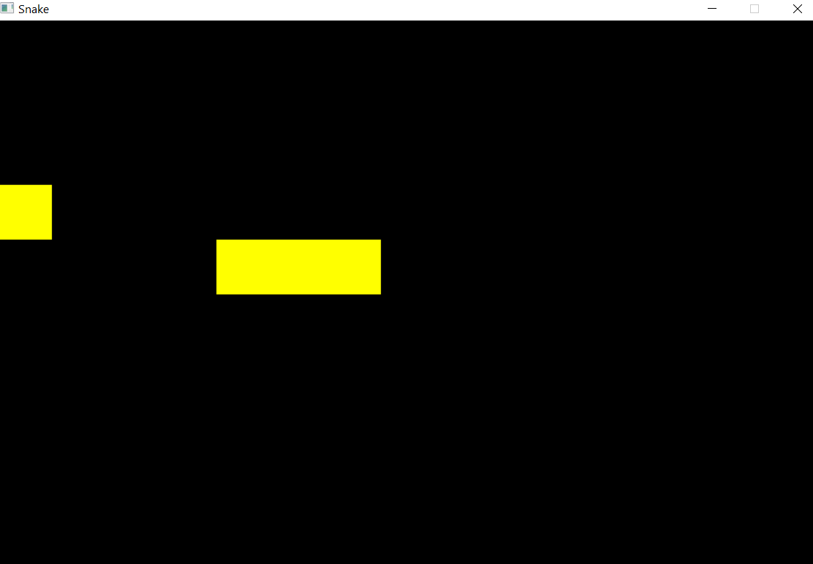

## **Snake**

Simple Snake game coded in C++ using SDL library.

Game functions:
- [x] you must gain points (-> make snake growing)
- [x] array (left, right, up or down) turns snake direction
- [x] game is over, when snake will touch the wall
- [ ] speed/slow bonus

